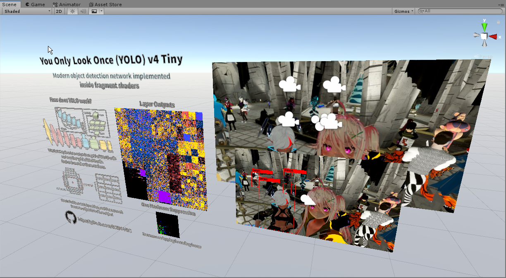
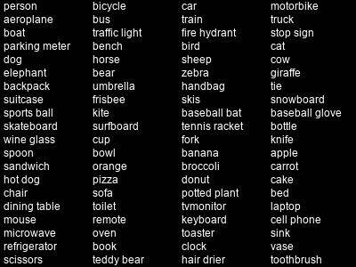

# YOLOv4 Tiny in UnityCG/HLSL

Video Demo: https://twitter.com/SCRNinVR/status/1380238589238206465?s=20

## Overview

YOLOv4 Tiny is one of the fastest object detectors that exists currently. The goal of this project is to completely recreate it without any existing ML libraries such as Darknet, PyTorch, or TensorFlow in order to port it into a VR game called VRChat.

My naive implementation only runs around 30 FPS so it doesn't hog resources for VR. It is nowhere near as performant as the original.

This implementation is based on the TensorFlow version from https://github.com/hunglc007/tensorflow-yolov4-tflite

## Setup
1. Download the package from Release
2. Import
3. Done, no dependencies
4. Enter Play Mode to run the network

## Avatars
1. Look in the Prefabs folder
2. Drop the prefab onto your avatar

## Code
### Reading the Output
The basic setup is: **yolov4tiny.shader** -> **nms.shader** -> **output.shader**. To read the bounding boxes information, we loop through the output of **nms.shader**

This is a basic setup of how **output.shader** works, refer to the file for more information.
1. Setup the input, and feed in **nms_buffer.renderTexture**
```HLSL
Properties
{
    _NMSout ("NMS Output", 2D) = "black" {}
}
```

2. Import the functions
```HLSL
#include "nms_include.cginc"
```

3. Loop through the texture
```HLSL
const float2 scale = 0.5.xx;

uint i;
uint j;

// Loop through the 26x26 grid output
for (i = 0; i < 26; i++) {
    for (j = 0; j < 26; j++) {
        // Only draw a box if the confidence is over 50%
        uint4 buff = asuint(_NMSout[txL20nms.xy + uint2(i, j)]);
        float conf = f16tof32(buff.a);
        [branch]
        if (conf > 0.5) {
            // Class, 0 to 79
            float c = f16tof32(buff.b >> 16);
            // x, y is the center position of the bbox relative to 416, the initial image input size that goes into the network
            float x = f16tof32(buff.r >> 16);
            float y = f16tof32(buff.r);
            // w, h are the width and height of the bbox relative to 416, the initial image input size that goes into the network
            float w = f16tof32(buff.g >> 16);
            float h = f16tof32(buff.g);
            // Scale to camera resolution using UVs
            float2 center = float2(x, y) / 416.0;
            center.y = 1.0 - center.y;
            float2 size = float2(w, h) / 416.0 * scale;
        }
    }
}

// YOLOv4 tiny has two outputs, remember to go through the second one too
// Loop through the 13x13 grid output
for (i = 0; i < 13; i++) {
    for (j = 0; j < 13; j++) {
        // Only draw a box if the confidence is over 50%
        uint4 buff = asuint(_NMSout[txL17nms.xy + uint2(i, j)]);
        float conf = f16tof32(buff.a);
        [branch]
        if (conf > 0.5) {
            // Class, 0 to 79
            float c = f16tof32(buff.b >> 16);
            // x, y is the center position of the bbox relative to 416, the initial image input size that goes into the network
            float x = f16tof32(buff.r >> 16);
            float y = f16tof32(buff.r);
            // w, h are the width and height of the bbox relative to 416, the initial image input size that goes into the network
            float w = f16tof32(buff.g >> 16);
            float h = f16tof32(buff.g);
            // Scale to camera resolution using UVs
            float2 center = float2(x, y) / 416.0;
            center.y = 1.0 - center.y;
            float2 size = float2(w, h) / 416.0 * scale;
        }
    }
}
```

The data is packed into two 16 bits per channel by the **nms.shader** and the layout is as follows:
```
R =      X       |    Y
G =      W       |    H
B =  Best class  |    Best class probability
A =              |    Bounding box confidence
```

All the classes the network can detect, based on the COCO Dataset classes:


Index 0 starts at the top left, i.e. 0 = person, 1 = bicycle and so on.

## How It Works

Since this is a direct implementation of a known architecture, you can refer to their original papers.

YOLOv4's paper is basically an ablation study on the different parameters and tuning to maximize speed and accuracy. I suggest reading the previous versions to have a better understanding of the actual architecture.

- [YOLO9000: Better, Faster, Stronger](https://arxiv.org/abs/1612.08242)
- [YOLOv3: An Incremental Improvement](https://arxiv.org/abs/1804.02767)
- [YOLOv4: Optimal Speed and Accuracy of Object Detection](https://arxiv.org/abs/2004.10934)

## Other Resources
- [Explanation of YOLO V4 a one stage detector](https://becominghuman.ai/explaining-yolov4-a-one-stage-detector-cdac0826cbd7)
- [(VIDEO) 2020 YOLOv4 paper summary](https://www.youtube.com/watch?v=bDK9NRF20To)
- [Visualize yolov4-tiny and yolov4 network structure diagram](https://www.programmersought.com/article/20944423185/)

If you have questions or comments, you can reach me on Discord: SCRN#8008 or Twitter: https://twitter.com/SCRNinVR
